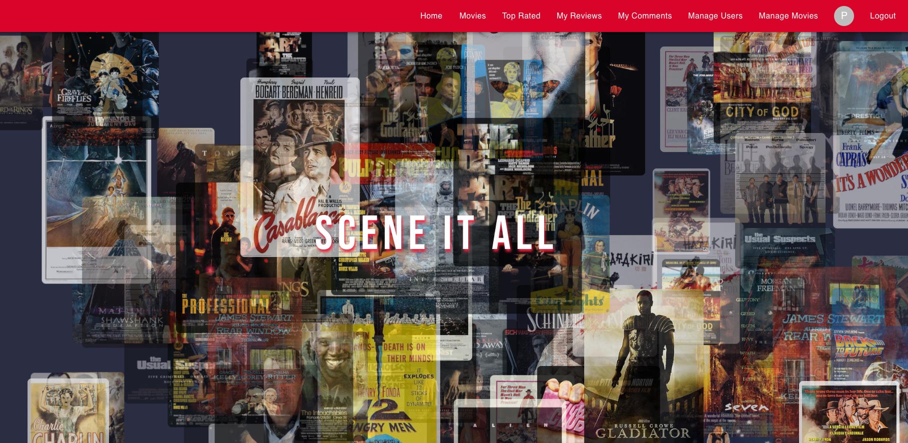

🎬 Scene It All

Scene It All is a full-stack movie review platform where users can browse movies, leave reviews and star ratings, comment on others’ reviews, and—if they’re admins—manage users and movie data through a dedicated interface. Designed with a clean, user-friendly experience in mind, the app encourages thoughtful engagement with film.

👥 Team
	•	Ben Hogle
	•	Daniel Garibay
	•	Eric Graham
	•	Olivia Chen

🚀 Features
	•	Browse a list of movies and view top-rated picks
	•	Register and log in to access user-specific features
	•	Leave reviews, star ratings, and comments
	•	View your own activity (reviews and comments)
	•	Admin dashboard for managing users and movies

🛠️ Technologies
	•	Frontend: React, custom CSS
	•	Backend: Express, Prisma, PostgreSQL
	•	Authentication: JWT
	•	Seeding/Data Generation: OMDb API, faker.js

📌 Planning & Process

Our team began with clear feature planning and wireframing key pages. This upfront organization helped keep the project focused and collaborative. Regular check-ins and a shared workflow helped us stay aligned across both frontend and backend development.

👤 Role & Contributions 
Eric Graham: 
	•	Designed and implemented the Prisma schema
	•	Imported real movie data from the OMDb API via a custom seed script
	•	Used faker.js to generate realistic reviews, ratings, and comments for development and testing
	•	Built the home page with custom CSS
	•	Contributed to the Movies and Admin Movies pages on the frontend

 Ben Hogle:

 Daniel Garibay:

 Olivia Chen:
 

⚠️ Challenges
	•	Managing merge conflicts and maintaining consistency across branches
	•	Ensuring team alignment during active development
	•	Learning to navigate collaborative version control efficiently

✅ What Worked
	•	Strong communication and early project planning
	•	Establishing clear roles and workflows
	•	Regular standups to keep everyone in sync
